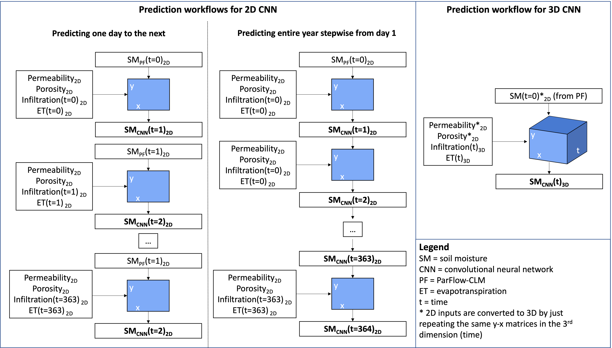

# Taylor CO, 2D and 3D Convolutional Neural Networks
This repo contains scripts to train 2D and 3D Convolutional Neural Network based on ParFlow-CLM simulations as described in Leonarduzzi et al. (submitted to Frontiers in Water). The two CNN model provided here and used in Leonarduzzi et al., are based on the research carried out in [Maxwell et al. (2021)](https://doi.org/10.3390/w13243633)

## Repo Contents
This repo contains python scripts to train a 2D CNN model or 3D CNN model for the Taylor catchment in Colorado. 
1. Script to train/test a 2D CNN on Taylor catchment (`2D_CNN.py`): This assumes the ParFlow-CLM runs for training exists and `RM_NN_2D_B1.py` containing the model definition, trains a 2D CNN and tests it. It requires indications of files paths as well as user choices.
2. Script to train/test a 3D CNN on Taylor catchment (`3D_CNN.py`): This assumes the ParFlow-CLM runs for training exists and `RM_NN_3D_A.py` containing the model definition, trains a 3D CNN and tests it. It requires indications of files paths as well as user choices.

## Requirements
Assumes you have run the needed ParFlow-CLM simulations (otherwise, you need to go in the Taylor_parflow folder and follow instructions there).  
You need to indicate (in 3D_CNN.py and/or 2D_CNN.py):
 - the path where the repository was downloaded (*PATH_TO_REPOSITORY*)
 - the path where the historical forcing and forcing scenario ParFlow-CLM simulations are (*INPUT_FOLDER*)
 - the absolute/relative path where you want the trained model and all outputs to be saved (*OUTPUT_FOLDER*)

**Reference**
 
*Maxwell, R.M.; Condon, L.E.; Melchior, P. A Physics-Informed, Machine Learning Emulator of a 2D Surface Water Model: What Temporal Networks and Simulation-Based Inference Can Help Us Learn about Hydrologic Processes. Water 2021, 13, 3633. https://doi.org/10.3390/w13243633*

