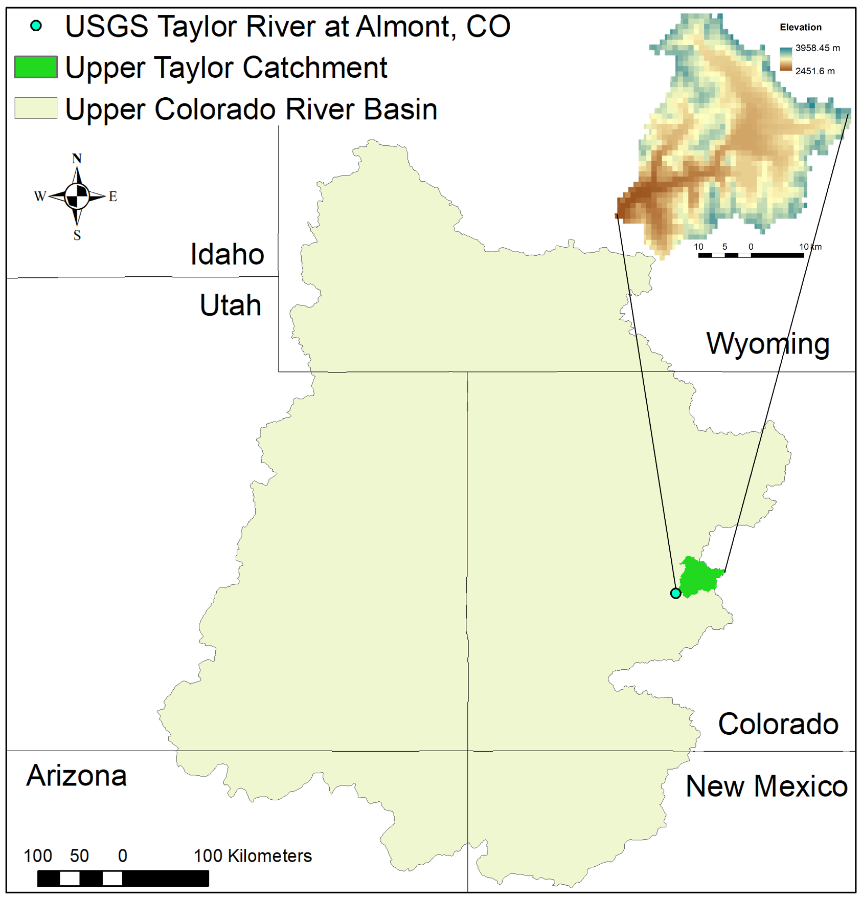

# Taylor CO, ParFlow-CLM
This repo contains a setup to run ensemble simulations for Taylor catchment (defined based on the USGS gage 0910000, Taylor river at Almont, CO) run with ParFlow.  The domain is subset from the Upper Colorado River Basin runs in [Tran et al. (2022)](https://doi.org/10.1038/s41597-022-01123-w) and the set-up for Taylor is described in Leonarduzzi et al. (submitted to Frontiers in Water).



## Repo Contents
This repo contains python scripts and required inputs to:
- subset from the Upper Colorado River Basin ([Tran et al. (2022)](https://doi.org/10.1038/s41597-022-01123-w)) the forcing and inputs to run ParFlow-CLM to create the inputs by subsetting from UCRB data
- generate additional forcing scenarios with increased temperature and decreased precipitation
- run parflow-clm for the Taylor catchment 

## How to use 
To reproduce the results in Leonarduzzi et al.,:
1. clone the repository and cd into it
        git clone * NEED TO FILL THIS ONCE IT'S ON GIT *
2. Download data for Upper Colorado River Basin:
    - NLDAS forcing for every water year of interest (here the link/example path for 1988, to reproduce results neede: 1988,1990,2000,2002,2021,2013,2015,2016,2018) https://datacommons.cyverse.org/browse/iplant/home/shared/commons_repo/curated/Tran_UpperCO_simulation_Sep2020/decadal_simulation/NLDAS/1988  
        --> place them in UCRB/1988/NLDAS/
    - Initial Pressure (i.e. pressure for timestep 0) for all water years of interest (here the link/example path for 1988, to reproduce results neede: 1988,1990,2000,2002,2021,2013,2015,2016,2018) https://datacommons.cyverse.org/browse/iplant/home/shared/commons_repo/curated/Tran_UpperCO_simulation_Sep2020/1988/press/UC_clm_1988.out.press.00000.pfb  
        --> place them in UCRB/1988/
    - Static inputs  
        slope in x: https://datacommons.cyverse.org/browse/iplant/home/shared/commons_repo/curated/Tran_UpperCO_simulation_Sep2020/decadal_simulation/parflow_input/UpperCO.slopex.rivth1500.pfb  
        slope in y: https://datacommons.cyverse.org/browse/iplant/home/shared/commons_repo/curated/Tran_UpperCO_simulation_Sep2020/decadal_simulation/parflow_input/UpperCO.slopey.rivth1500.pfb  
        indicator file: https://datacommons.cyverse.org/browse/iplant/home/shared/commons_repo/curated/Tran_UpperCO_simulation_Sep2020/decadal_simulation/parflow_input/UpperCO_IndicatorFile_v2.pfb  
        landcover file: https://datacommons.cyverse.org/browse/iplant/home/shared/commons_repo/curated/Tran_UpperCO_simulation_Sep2020/decadal_simulation/clm_input/drv_vegm_v2.UC.dat  
        --> place them in *UCRB/static_UCRB/*  
        vegetation properties file: https://datacommons.cyverse.org/browse/iplant/home/shared/commons_repo/curated/Tran_UpperCO_simulation_Sep2020/decadal_simulation/clm_input/drv_vegp.dat  
        --> place it in *static_Taylor/*
        
3. Run (`subset_UCRB.py`)
    - make sure the *water_years* it's a list of all the water years you're interested in
    - make sure the topology (splitting the domain over processors) is correct: P * Q * R = number processor (default: 3-3-1, 9 processors)      
    - assumes all the paths instructions provided here are followed, otherwise you'll have to correctly adjust all paths
    - run command: *python subset_UCRB.py*
    - after running this, you can now delete the UCRB forcing files, which use up a lot of memory (note: if you don't have a lot of memory, you could do this process one year at a time)

4. Create solid file for Taylor (only need to do this once).  
    Run Commands:  
    *cd static_Taylor*   
    *$PARFLOW_DIR/bin/pfmask-to-pfsol --mask mask.pfb --vtk MaskTaylor.vtk --pfsol Taylor.pfsol --bottom-patch-label 2 --side-patch-label 3 --z-top 1000.0 --z-bottom 0.0*

5. Create forcing scenarios with homogenously increased temperature and decreased precipitation (`PF_generate_forcing_scenarios.py`)
    - make sure the *water_years* it's a list of all the water years you're interested in
    - choose the forcing scenario number/corrections (currently set-up to reproduce results in Leonarduzzi et al.)
    - make sure the topology (splitting the domain over processors) is correct: P * Q * R = number processor (default: 3-3-1, 9 processors)      
    - assumes all the paths instructions provided here are followed, otherwise you'll have to correctly adjust all paths
    - run command: *python PF_generate_forcing_scenarios.py*

6. Run parflow (`Taylor_clm.py`):
    - cd into the folder you want to run
        - e.g., historical 1988: *cd historical_forcing/1988*
        - e.g., temp020_prec080 1988, *cd forcing_scenarios/temp020_prec080/*
    - run command: *python Taylor_clm.py YEAR_RUN ROOTH_PATH* where:  
        - YEAR_RUN is the water year for which you want to run (e.g., 1988)    
		- ROOTH_PATH is the path to where you placed Taylor_parflow (e.g., /home/user/Desktop/Taylor_CO/Taylor_parflow/)    
        --> run: *python Taylor_clm.py 1988 /home/user/Desktop/Taylor_CO/Taylor_parflow/* (same command for historical and forcing scenarios, assumes you're running the command from the right folder)

## FINAL FOLDER ORGANIZATION:
To reduce the number of files in this example:
- we show and example just for water 1988 historical forcing and 1 forcing scenario with temp + 0.2 prec *0.8
- we used Forcing_var instead of: APCP, SPFH, DLWR, Temp, DSWR, UGRD, Press, VGRD (8 files * day)
- we only show the Forcing_var for 2 days of the year (366 or 365 * each forcing variable)
- we don't show all the outputs of parflow runs *ALL PARFLOW OUTPUTS.pfb and .dist*

Explanation file origin:
- #default# is downloaded when cloning this repo
- #UCRB# you should download yourself from https://datacommons.cyverse.org/browse/iplant/home/shared/commons_repo/curated/Tran_UpperCO_simulation_Sep2020 
- for the other case it's described when/how the corresponding file will be created

```bash
Taylor_parflow/  
    ├── images/  
    │   └── CaseStudy.png #default#  
    ├── static_Taylor/  
    │   ├── drv_clmin.dat #default#  
    │   ├── drv_vegp.dat #UCRB#  
    │   ├── drv_vegm_v2.Taylor.dat #created with subset_UCRB.py#  
    │   ├── mask.pfb #created with subset_UCRB.py#  
    │   ├── slope_x.pfb #created with subset_UCRB.py#  
    │   ├── slope_y.pfb #created with subset_UCRB.py#  
    │   └── Taylor.IndicatorFile_v2.pfb #created with subset_UCRB.py#  
    ├── UCRB/  
    │   ├── 9110000_WatershedMask.tif #default#  
    │   ├── static_UCRB/  
    │   │   ├── drv_vegm_v2.UC.dat #UCRB#  
    │   │   ├── UpperCO.slopex.rivth1500.pfb #UCRB#  
    │   │   ├── UpperCO.slopey.rivth1500.pfb #UCRB#  
    │   │   └── UpperCO_IndicatorFile_v2.pfb #UCRB#  
    │   └── 1988/  
    │       ├── UC_clm_1988.out.press.00000.pfb #UCRB#  
    │       └── NLDAS/  
    │           ├── NLDAS.Forcing_var.000001_to_000024.pfb #UCRB#  
    │           ├── ...  #UCRB#  
    │           └── NLDAS.Forcing_var.008761_to_008784.pfb #UCRB#             
    ├── historical_forcing/  
    │   └── 1988/  
    │       │   NLDAS/  
    │       │   ├── NLDAS.Forcing_var.000001_to_000024.pfb #created with subset_UCRB.py#  
    │       │   ├── NLDAS.Forcing_var.000001_to_000024.pfb.dist #created with subset_UCRB.py#  
    │       │   ├── ... #created with subset_UCRB.py#  
    │       │   ├── NLDAS.Forcing_var.008761_to_008784.pfb #created with subset_UCRB.py#    
    │       │   └── NLDAS.Forcing_var.008761_to_008784.pfb.dist #created with subset_UCRB.py#                     
    │       ├── drv_clmin.dat  #created with subset_UCRB.py#  
    │       ├── drv_vegp.dat #copied here within Taylor_clm.py run for 1988#  
    │       ├── drv_vegm_v2.Taylor.dat #copied here within Taylor_clm.py run for 1988#  
    │       ├── initial_pressure.pfb #created with subset_UCRB.py#  
    │       ├── initial_pressure.pfb.dist #created with Taylor_clm.py run for 1988#  
    │       ├── slope_x.pfb  #copied here within Taylor_clm.py run for 1988#  
    │       ├── slope_x.pfb.dist #created with Taylor_clm.py run for 1988#  
    │       ├── slope_y.pfb  #copied here within Taylor_clm.py run for 1988#  
    │       ├── slope_y.pfb.dist #created with Taylor_clm.py run for 1988#  
    │       ├── Taylor.IndicatorFile_v2.pfb #copied here within Taylor_clm.py run for 1988#  
    │       └── *ALL PARFLOW OUTPUTS.pfb and .dist* #created with Taylor_clm.py run for 1988#        
    ├── forcing_scenarios/  
    │   └── temp020_prec080/  
    │       └── 1988/  
    │           ├── NLDAS/  
    │           │   ├── NLDAS.Forcing_var.000001_to_000024.pfb #created/copied with PF_generate_forcing_scenarios.py#  
    │           │   ├── NLDAS.Forcing_var.000001_to_000024.pfb.dist #created/copied with PF_generate_forcing_scenarios.py#  
    │           │   ├── ... #created/copied with PF_generate_forcing_scenarios.py#  
    │           │   ├── NLDAS.Forcing_var.008761_to_008784.pfb #created/copied with PF_generate_forcing_scenarios.py#  
    │           │   └── NLDAS.Forcing_var.008761_to_008784.pfb.dist #created/copied with PF_generate_forcing_scenarios.py#          
    │           ├── drv_clmin.dat  #created with subset_UCRB.py#  
    │           ├── drv_vegp.dat #copied here within Taylor_clm.py run for 1988 for scenario temp020_prec080#  
    │           ├── drv_vegm_v2.Taylor.dat #copied here within Taylor_clm.py run for 1988 for scenario temp020_prec080#  
    │           ├── initial_pressure.pfb #created with subset_UCRB.py#  
    │           ├── initial_pressure.pfb.dist #created with Taylor_clm.py run for 1988 for scenario temp020_prec080#  
    │           ├── slope_x.pfb  #copied here within Taylor_clm.py run for 1988 for scenario temp020_prec080#  
    │           ├── slope_x.pfb.dist #created with Taylor_clm.py run for 1988 for scenario temp020_prec080#  
    │           ├── slope_y.pfb  #copied here within Taylor_clm.py run for 1988 for scenario temp020_prec080#  
    │           ├── slope_y.pfb.dist #created with Taylor_clm.py run for 1988 for scenario temp020_prec080#  
    │           ├── Taylor.IndicatorFile_v2.pfb #copied here within Taylor_clm.py run for 1988 for scenario temp020_prec080#   
    │           └── *ALL PARFLOW OUTPUTS.pfb and .dist* #created with Taylor_clm.py run for 1988 for scenario temp020_prec080#         
    ├── PF_generate_forcing_scenarios.py #default#  
    ├── README.md #default#  
    ├── subset_UCRB.py #default#  
    └── Taylor_clm.py #default#  
```    
**Reference**
<Br>
*Tran, H., Zhang, J., O’Neill, M.M. et al. A hydrological simulation dataset of the Upper Colorado River Basin from 1983 to 2019. Sci Data 9, 16 (2022). https://doi.org/10.1038/s41597-022-01123-w*

